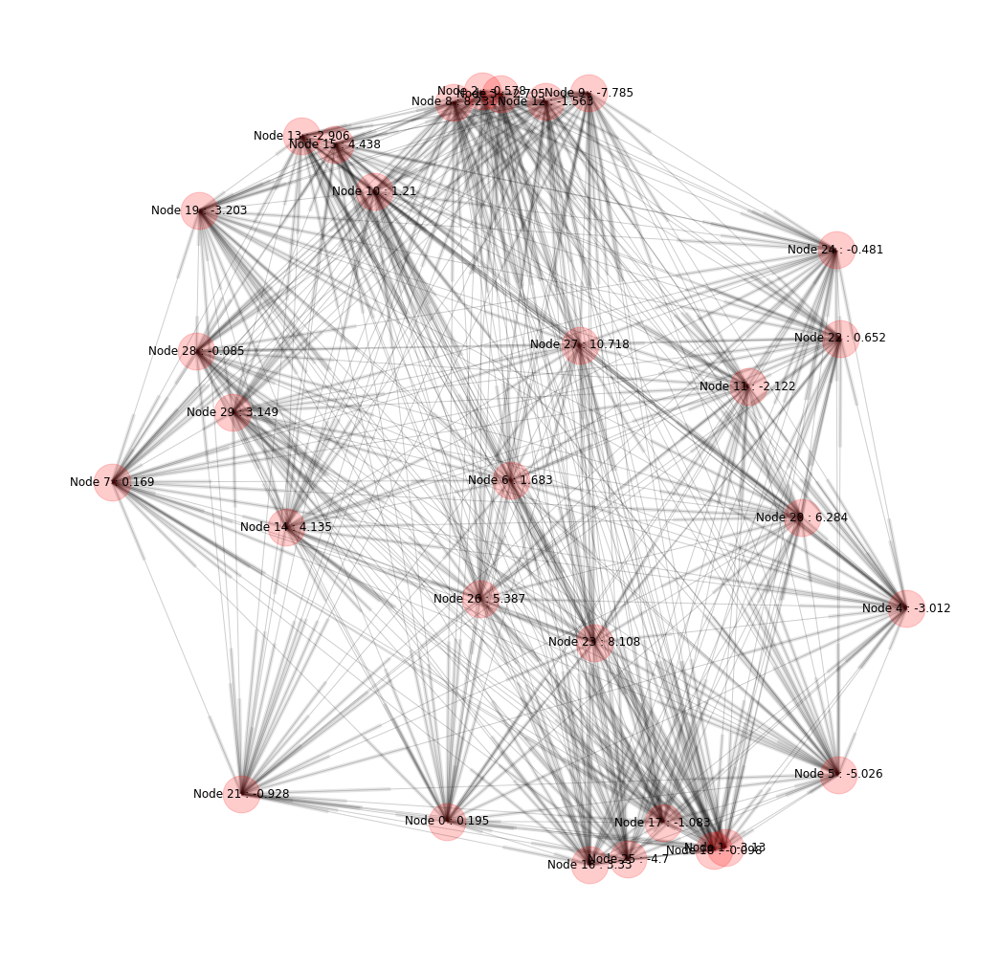
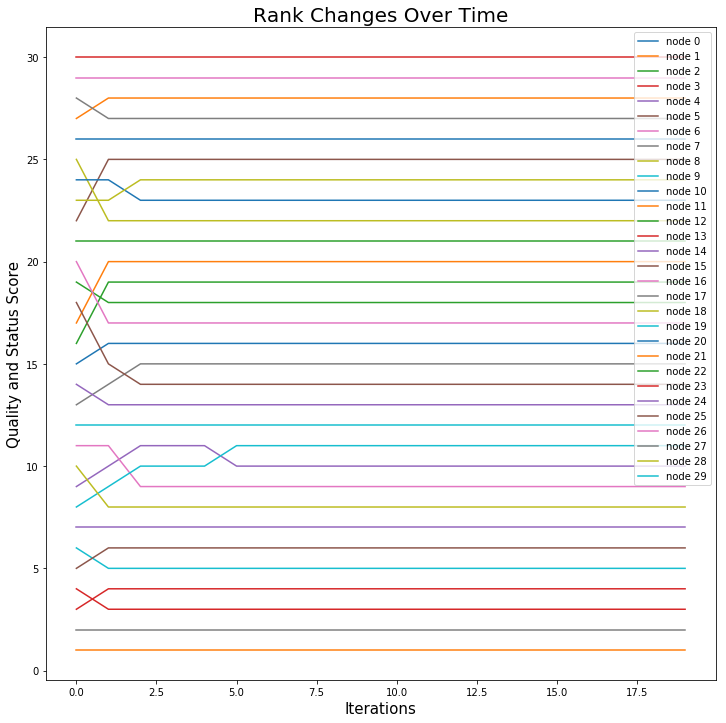

# NetworkSimulation

## Venture Capital(vc) Industry Network Analysis:

The purpose of this project is to simulate the network changes in Venture Capital Industry over the time. Gini Coefficient, Jaccard Similarity were used as evaluation metrics to analyze the final centrality of nodes. The simulations were conducted under different initial status and evolved under different rules.

### Files:

**main.py**: Instantiate the class NetworkSimulation with different initial parameters for constructing different graph, 
the class contains functions to calculate correlation, gini correlation, average converging time, status quality reordering
and status quality gap, and can be called to generate the graphs according to requirements.

**formula.py**: Contains the functions for doing the small tasks in updating the graph, calculating necessary statistics, and ranking

**update_node.py**: Contains functions to update each nodes in each round and functions to update the graph.

**ultimate_simulation.py**: For the 1210 * 100 times simulation.

**utilities.py**: Mainly contains function to visualize the results or intermediate result.

### Attributes for each node during simulation:
```
{'average similarity': 0.30871845391655817,
   'choice history': [1, 8, 1, 1, 3, 2, 4, 9, 4, 3, 9, 7],
   'current category': 7,
   'perceived quality': -4086.7179690911626,
   'rank': 17,
   'round': 11,
   'status change': -3.2875863237302738e-07,
   'status score': 0.20396508658289464}
```

### Middle-stage node status:


### Node changes over time:


### Reference:
[1]Manzo, G., & Baldassarri, D. (2015). Heuristics, interactions, and status hierarchies An agent-based model of deference exchange. Sociological Methods & Research, 44(2), 329-387

[2]Lynn, F. B., Podolny, J. M., & Tao, L. (2009). A sociological (de) construction of the relationship between status and quality. American Journal of Sociology, 115(3), 755-804

[3]Snijders et. al. (2009) Introduction to stochastic actor-based models for network dynamics
